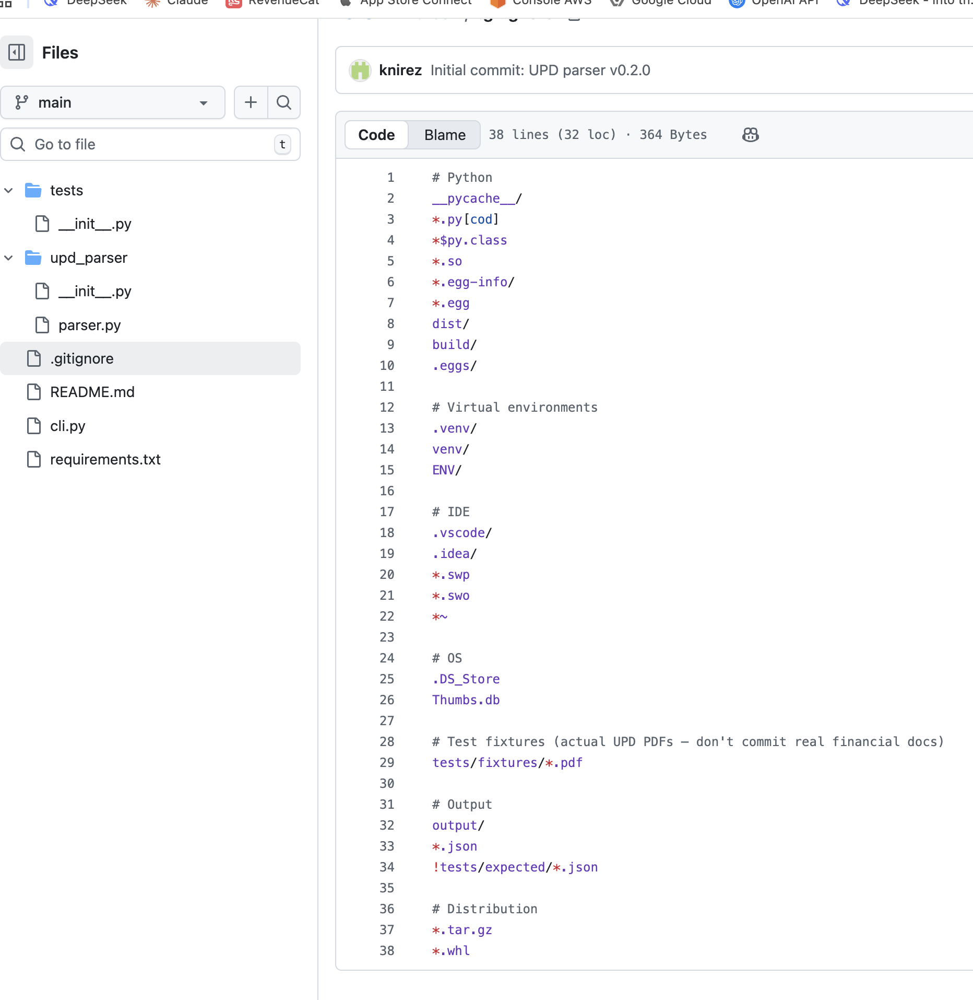
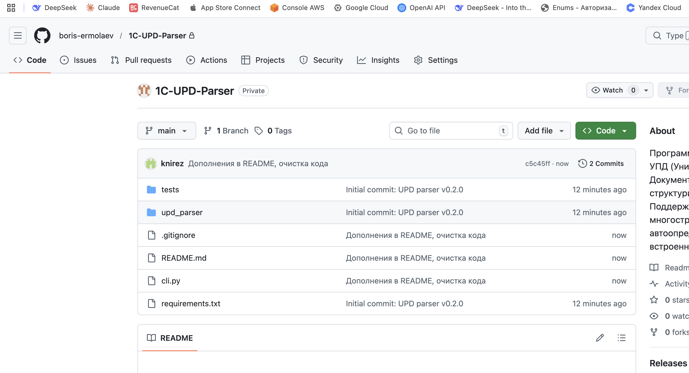
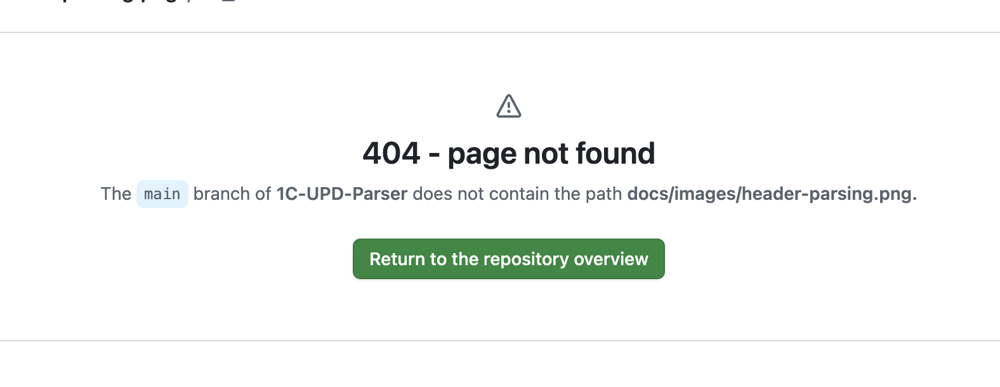

# UPD Parser

Программный разбор PDF-файлов УПД (Универсальный Передаточный Документ) с извлечением структурированных данных в формате JSON.

Парсер предназначен для обработки документов, сгенерированных из 1С:Предприятие и аналогичных учётных систем.

---

## Что содержит этот репозиторий

Данный репозиторий -- это **автономная Python-библиотека** для разбора PDF-файлов формата УПД. Она не требует подключения к 1С, не использует сеть и не зависит от внешних сервисов. На вход подаётся PDF-файл, на выходе -- структурированный JSON с извлечёнными данными: реквизиты продавца и покупателя, табличная часть, итоги, режим НДС, результат валидации. Библиотека подходит для случаев, когда требуется программно разобрать УПД и самостоятельно интегрировать результат в свою систему.

**Точность извлечения.** Парсер из данного репозитория работает на основе регулярных выражений и пространственного анализа PDF без использования AI. Средняя точность извлечения данных составляет **80--85%** в зависимости от компоновки документа. Для документов со стандартной разметкой 1С:Предприятие результат, как правило, выше; для нестандартных или сложных макетов -- ниже. Результат всегда рекомендуется проверять через встроенную валидацию (`validation.is_valid`). Для сравнения, наша продуктивная система, использующая OCR и AI-обработку, обеспечивает точность **98,8%** на тех же типах документов.

---

## Полная система автоматизации документооборота

> Помимо данной библиотеки, мы разрабатываем и поддерживаем готовую продуктивную систему для автоматизации загрузки первичных документов в 1С. Система обслуживает реальных клиентов и в настоящее время работает в режиме пилотного проекта. Мы открыты для подключения новых пользователей.

В отличие от библиотеки из этого репозитория, которая только извлекает данные из PDF, продуктивная система берёт на себя весь цикл: от распознавания документа до создания готового документа в базе 1С. Система предоставляет удобный пользовательский интерфейс. Для подключения к 1С на стороне клиента устанавливается расширение, после чего система получает доступ к справочникам и документам базы данных. Ниже описаны ключевые возможности системы.

Функциональность системы тесно связана с возможностями проекта [1c_mcp](https://github.com/vladimir-kharin/1c_mcp), обеспечивающего взаимодействие с платформой 1С. Отдельная благодарность **Владимиру Харину** за разработку и поддержку этого инструмента.

Поддерживаемые платформы: **1С:Бухгалтерия 8.3**, **1С:Комплексная автоматизация**. Расширение на иные конфигурации -- по запросу.

### Распознавание и извлечение данных

Встроенный OCR-движок принимает документы в различных форматах: изображения (JPG, PNG), PDF-файлы, документы Word (.docx) и таблицы Excel (.xlsx/.xls). Поддерживаемые типы первичных документов: УПД, ТОРГ-12, кассовые чеки, акты выполненных работ, накладные, авансовые отчёты и банковские выписки (формат 1С ClientBankExchange и PDF). Распознанные данные автоматически структурируются и подготавливаются для загрузки в 1С.

### Автоматическое сопоставление с данными 1С

После извлечения данных из документа система выполняет поиск и сопоставление по справочникам 1С пользователя в режиме реального времени. Контрагент определяется по ИНН и наименованию. Номенклатура подбирается из каталога 1С с поддержкой нечёткого поиска и пользовательских маппингов. Сопоставление работает в агентном режиме: система запоминает предпочтения пользователя и ранее выполненные сопоставления, что позволяет автоматически применять накопленный опыт к новым документам без повторного ручного выбора. Договор контрагента подбирается автоматически на основании контекста документа. Все отображаемые значения -- склады, валюты, счета учёта, единицы измерения, статьи затрат -- берутся из пользовательской базы 1С, а не заданы жёстко в коде.

### Создание контрагентов с данными ЕГРЮЛ

Если контрагент не найден в базе 1С, система позволяет создать его одним действием с автоматическим заполнением реквизитов из реестра ЕГРЮЛ: полное наименование, ОГРН, ОКПО, дата регистрации, юридический адрес. Для нового контрагента автоматически создаётся договор по умолчанию с корректными настройками НДС и валюты.

### Пересчёт количества и единиц измерения

При несовпадении единиц измерения в документе и в базе 1С система выполняет автоматический пересчёт (например, кг в штуки, литры в бутылки) с учётом типа товара и его характеристик.

### Определение режима НДС

Система автоматически определяет режим налогообложения документа: НДС в сумме, НДС сверху, без НДС. Ставка НДС извлекается из каждой строки и маппится в справочник ставок 1С.

### Статус обработки

Каждая позиция в табличной части документа отображает статус сопоставления с номенклатурой 1С. Пользователь видит, какие позиции найдены автоматически, а какие требуют ручного выбора или создания новой записи.

### Интерфейс системы

Ниже представлены фрагменты интерфейса продуктивной системы при обработке кассового чека.

Шапка документа: система автоматически распознала реквизиты, определила контрагента по ИНН в базе 1С (зелёная отметка), подобрала договор, рассчитала итоги с НДС. Все поля (склад, валюта, счета расчётов, способ зачёта аванса) заполнены значениями из пользовательской базы 1С.





Табличная часть: наименования из чека сопоставлены с номенклатурой 1С, количество пересчитано из единиц документа в единицы учёта 1С, ставка НДС определена для каждой строки, указан счёт учёта. Статус "Найден" означает успешное автоматическое сопоставление с записью из справочника номенклатуры пользователя.



### API для внешних систем

Помимо пользовательского интерфейса, продуктивная система предоставляет отдельный API-эндпоинт со встроенными возможностями OCR. Внешние системы могут отправлять документы (изображения, PDF, Word, Excel) и в ответе получать структурированный JSON, готовый для интеграции в учётные системы. Поддерживаемые типы документов: УПД, ТОРГ-12, кассовые чеки, акты, накладные, авансовые отчёты, банковские выписки.

---

## Возможности библиотеки (данный репозиторий)

- Разбор документов со статусом 1 (счёт-фактура + передаточный документ) и статусом 2 (только передаточный документ)
- Обработка одностраничных и многостраничных документов с автоматической склейкой строк табличной части
- Извлечение всех стандартных полей: реквизиты продавца и покупателя, ИНН/КПП, адреса, товарные позиции, итоги, метаданные передачи
- Автоматическое определение режима НДС: "none" (без НДС), "ontop" (НДС сверху), "included" (НДС в сумме)
- Встроенная валидация: проверка арифметики по строкам (цена x количество = сумма), сверка итогов, контроль НДС
- Вывод результата в формате JSON или в виде читаемой таблицы


---

## Установка (пошаговая инструкция)

### 1. Проверьте наличие Python

Откройте терминал и выполните команду:

```bash
python3 --version
```

Если вы видите что-то вроде `Python 3.10.12` -- всё в порядке, Python установлен. Если команда не найдена, установите Python с официального сайта: https://www.python.org/downloads/

### 2. Скачайте проект

Если у вас установлен Git:

```bash
git clone <url-вашего-репозитория>
cd upd-parser
```

Если Git не установлен, скачайте архив проекта с GitHub (кнопка "Code" -> "Download ZIP"), распакуйте его и откройте терминал в папке проекта.

### 3. Создайте виртуальное окружение (рекомендуется)

Виртуальное окружение изолирует зависимости проекта от системных пакетов. Это стандартная практика в Python-разработке.

```bash
python3 -m venv .venv
```

Активируйте его:

На macOS и Linux:
```bash
source .venv/bin/activate
```

На Windows:
```bash
.venv\Scripts\activate
```

После активации в начале строки терминала появится `(.venv)`.

### 4. Установите зависимости

```bash
pip install -r requirements.txt
```

Эта команда установит две библиотеки: `pdfplumber` (извлечение текста и таблиц из PDF) и `pypdf` (чтение метаданных PDF).

---

## Использование

### Из командной строки

Парсер имеет два режима вывода.

Режим 1 -- читаемая таблица (для визуальной проверки):

```bash
python3 cli.py "путь/к/файлу/УПД.pdf" --summary
```

Режим 2 -- полный JSON (для программной обработки):

```bash
python3 cli.py "путь/к/файлу/УПД.pdf"
```

Сохранение результата в файл:

```bash
python3 cli.py "путь/к/файлу/УПД.pdf" -o результат.json
```

Компактный JSON (без отступов):

```bash
python3 cli.py "путь/к/файлу/УПД.pdf" --compact
```

Пример с реальным файлом:

```bash
python3 cli.py "/Users/user/Downloads/УПД (статус 1) № 1234 от 15 марта 2025 г.pdf" --summary
```

Обратите внимание: если в имени файла есть пробелы или скобки, путь необходимо взять в кавычки.

### Как библиотека Python

```python
from upd_parser import parse_upd

doc = parse_upd("путь/к/файлу/УПД.pdf")

# Доступ к полям шапки
print(doc.invoice_number)        # "1234"
print(doc.invoice_date_iso)      # "2025-03-15"
print(doc.seller.name)           # 'ООО "Вектор"'
print(doc.seller.inn)            # "7707123456"
print(doc.buyer.name)            # 'ООО "Альфа-Строй"'

# Табличная часть
print(len(doc.items))            # 10
print(doc.items[0].name)         # "Кабель силовой ВВГнг 3x2.5, 100м"
print(doc.items[0].vat_rate_percent)  # 20

# Итоги
print(doc.totals.subtotal)       # Decimal('45800.00')
print(doc.totals.vat)            # Decimal('9160.00')
print(doc.totals.total)          # Decimal('54960.00')

# Режим НДС
print(doc.vat.vat_mode)          # "ontop"
print(doc.vat.vat_rates)         # [20]
print(doc.vat.detection_confidence)  # "high"

# Валидация
print(doc.validation.is_valid)   # True

# Экспорт в словарь (для JSON-сериализации)
data = doc.to_dict()
```

---

## Структура JSON-ответа

```json
{
  "status": 1,
  "invoice_number": "1234",
  "invoice_date": "15 марта 2025 г",
  "invoice_date_iso": "2025-03-15",
  "seller": {
    "name": "ООО \"Вектор\"",
    "inn": "7707123456",
    "kpp": "770701001",
    "address": "119002, г.Москва, ул. Арбат, д. 10, офис 5"
  },
  "buyer": {
    "name": "ООО \"Альфа-Строй\"",
    "inn": "5024567890",
    "kpp": "502401001",
    "address": "140000, Московская обл., г.Люберцы, ул. Кирова, д. 3, помещение 12"
  },
  "currency": "Российский рубль",
  "currency_code": "643",
  "vat": {
    "vat_mode": "ontop",
    "vat_rates": [20],
    "detection_confidence": "high",
    "detection_reason": "..."
  },
  "items": [
    {
      "row_number": 1,
      "product_code": "ВК-00003201",
      "name": "Кабель силовой ВВГнг 3x2.5, 100м",
      "unit_code": "006",
      "unit_name": "м",
      "quantity": 4.0,
      "unit_price": 385.0,
      "subtotal": 1540.0,
      "excise": "без акциза",
      "vat_rate": "20%",
      "vat_rate_percent": 20,
      "vat_amount": 308.0,
      "total": 1848.0
    }
  ],
  "totals": {
    "subtotal": 45800.0,
    "vat": 9160.0,
    "total": 54960.0
  },
  "validation": {
    "is_valid": true,
    "errors": [],
    "warnings": []
  }
}
```

---

## Режимы НДС

Парсер автоматически определяет режим НДС на основе математического анализа строк табличной части. Результат записывается в поле `vat.vat_mode` и соответствует семантике полей 1С:

| Режим | Значение vat_mode | Поле 1С | Описание |
|-------|-------------------|---------|----------|
| Без НДС | `"none"` | НДСНеВыделять = true | В документе отсутствует НДС. Все строки имеют ставку "--" или "без НДС", сумма НДС равна нулю. |
| НДС сверху | `"ontop"` | СуммаВключаетНДС = false | Цена указана без НДС. Итого = сумма без НДС + НДС. Определяется по совпадению: цена x количество = сумма без налога. |
| НДС в сумме | `"included"` | СуммаВключаетНДС = true | Цена указана с НДС. Итого = цена x количество. Определяется по совпадению: цена x количество = сумма с налогом. |

Каждая строка табличной части содержит поле `vat_rate_percent` (целое число: 0, 10, 20), которое можно напрямую использовать для маппинга в значения 1С: `"НДС20"`, `"НДС10"`, `"БезНДС"`.

Уровень уверенности определения (`detection_confidence`) принимает значения:
- `"high"` -- все строки однозначно соответствуют одному режиму
- `"medium"` -- большинство строк соответствуют, но есть неоднозначности
- `"low"` -- недостаточно данных для надёжного определения

---

## Извлекаемые поля

| Поле УПД | Путь в JSON | Примечание |
|----------|-------------|------------|
| Счёт-фактура (номер) | `invoice_number` | |
| Дата | `invoice_date` / `invoice_date_iso` | Исходный формат и ISO 8601 |
| Статус | `status` | 1 или 2 |
| Продавец | `seller.name` / `.inn` / `.kpp` / `.address` | |
| Покупатель | `buyer.name` / `.inn` / `.kpp` / `.address` | |
| Валюта | `currency` / `currency_code` | |
| Грузоотправитель | `consigner` | |
| Грузополучатель | `consignee` | |
| Табличная часть (колонки А--11) | `items[]` | Все 16 колонок стандартной формы |
| Всего к оплате | `totals` | Поля: subtotal, vat, total |
| Режим НДС | `vat` | Поля: vat_mode, vat_rates, detection_confidence |
| Поля [8]--[19] | `transfer` | Основание передачи, субъекты-составители |

---

## Валидация

Парсер автоматически выполняет следующие проверки:

- Арифметика по строкам: цена x количество = сумма без налога (для каждой позиции)
- Сумма строк: сумма всех позиций = заявленное значение "Всего к оплате"
- Контроль НДС: сумма НДС по строкам = заявленный итог НДС
- Контроль итогов: сумма с НДС по строкам = заявленный итог с НДС
- Проверка формулы: сумма без налога + НДС = итого с налогом
- Валидация режима НДС: соответствие заявленного режима фактическим данным (например, при режиме "none" ни одна строка не должна содержать сумму НДС)

Результаты доступны в поле `validation`:
- `is_valid` -- итоговый статус (true/false)
- `errors` -- критические расхождения, при которых данные нельзя считать достоверными
- `warnings` -- незначительные расхождения (как правило, ошибки округления)

---

## Ограничения

- Парсер оптимизирован для машинно-сгенерированных PDF (1С:Предприятие, Контур, СБИС). Для сканированных бумажных документов потребуется предварительная обработка через OCR.
- Извлечение адресов использует пространственное кадрирование страницы, рассчитанное на стандартную компоновку 1С. Документы с нестандартной разметкой могут потребовать доработки.
- Парсер протестирован на документах статуса 1 и 2 с количеством позиций до 14 на 2 страницах. Документы с существенно иным форматированием могут потребовать корректировок.

---

## Структура проекта

```
upd-parser/
├── README.md
├── requirements.txt
├── cli.py                  # Интерфейс командной строки
├── .gitignore
├── docs/
│   └── images/             # Скриншоты для документации
├── upd_parser/
│   ├── __init__.py
│   └── parser.py           # Основная логика разбора
└── tests/
    └── fixtures/           # Тестовые PDF (не включаются в репозиторий)
```

---

## Лицензия

MIT
